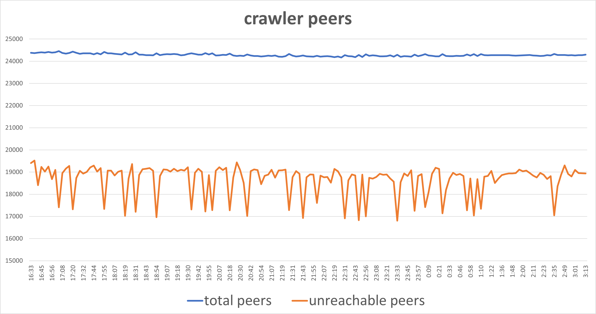

## Table of Contents

- [简介](#简介)
- [Thesis](#thesis)
  - [Crawling-IPFS-Networking20-Demo](#crawling-ipfs-networking20-demo)
  - [IPFS-Churn-ICDCSW22](#ipfs-churn-icdcsw22)
  - [IPFS-ICDCS22](#ipfs-icdcs22)
  - [IPFS-Measurement-SIGCOMM22](#ipfs-measurement-sigcomm22)
- [Data Collection](#data-collection)
  - [ipfs-crawler 主动爬取DHT_server](#ipfs-crawler-主动爬取dht_server)
  - [go-ipfs(kubo) 被动爬取ipfs中的peers](#go-ipfs(kubo)-被动爬取ipfs中的peers)
  - [hydra-booster 被动爬取ipfs中的peers](#hydra-booster-被动爬取ipfs中的peers)
  - [nebula-crawler 主动爬取DHT_server](#nebula-crawler-主动爬取dht_server)
- [疑惑的点](#疑惑的点)

## 简介
主要工作专注于数据收集，对论文中数据分析的部分并未复现。整体工作思路为以论文为单位来复现论文中收集数据的方法。  

## Thesis
### Crawling-IPFS-Networking20-Demo
该论文仅提供了一种数据采集的工具，即ipfs-crawler，详情可见[ipfs-crawler 主动爬取DHT_server](#ipfs-crawler-主动爬取dht_server)  

### IPFS-Churn-ICDCSW22
该论文介绍了一种passively来获取数据的方式，即爬虫伪装成正常的peers，来获取connected peers的数据。文中使用了两种工具，go-ipfs(kubo)与hydra-booster。两者的详情可见：  
- [go-ipfs(kubo) 被动爬取ipfs中的peers](#go-ipfs(kubo)-被动爬取ipfs中的peers)
- [hydra-booster 被动爬取ipfs中的peers](#hydra-booster-被动爬取ipfs中的peers)

论文通过上述工具，对数个时间段内的ipfs进行监控，并分析了Churn、网络规模、用户客户端等情况  

**疑惑：**
- #1 boost-hydra的结果不吻合，且论文中H1、H2、Hydra三条曲线的实验参数不清楚
- #2 kubo的结果同样不吻合：P3中peers数目一直上涨，但是本地的情况则是上涨到一定的值（6k+）后会不在上涨甚至下跌，怀疑是peers主动断开连接，但是不清楚为什么不主动连接其他peers
- #3 ipfs的swarm，如何找到peers，什么时候决定连接什么时候决定断开，跟是否为DHT server是否有关系 & hydra-booster是否也遵循这样的规则

### IPFS-ICDCS22
主要思路是同kubo一样来建立peers之间的连接，之后通过监听peers的bitswap请求（want_have），来获取每个peer想获取的CID来分析  
该论文的工具未开源，但在kubo的源代码上魔改应该是不难实现的  
由于复现起来时间成本很大，暂未复现  

**疑惑：**
bitswap的具体流程：为何论文中说如果收到了"want_have c"，如果没返回"have c"的话将不能进入该peer的session？还有，其中会漏掉哪些数据？

### IPFS-Measurement-SIGCOMM22
该论文主要用到了三个数据集：  
- First Dataset: 抓取了所有DHT_server ，抓取工具：[nebula-crawler 主动爬取DHT_server](#nebula-crawler-主动爬取dht_server)  
- Second Dataset: 拿了所有ipfs.io 网关的后台数据，这个我们拿不到  
- Third Dataset: 相当于实验，publish & retrive，在A节点上发布一个任意文件后再在B节点上看多久能取回，并且统计寻找peers所消耗的时间与数据传输所消耗的时间，TODO  

## Data Collection
### ipfs-crawler 主动爬取DHT_server
github: https://github.com/trudi-group/ipfs-crawler  
ipfs-crawler 可以从boostrappers开始，不断获得未访问过的节点的k-buckets，直到没有未访问过的peer，类似于DFS/BFS，但由于Kademlia中为了保证网络的健壮性，即k-buckets中的都为可访问的peers，所以本爬取方式无法爬到处于DHT_client模式下的peers(e.g., peers that are behind NATs)  
通过该工具，可以获得：  
- 1. 所有peers(DHT_server)的
  - NodeID
  -  MultiAddrs
  - reachable
  - agent_version
  Example: 
```json
{
    "NodeID":"12D3KooWSSWpPrUnhC6MbpwGka2AiLASW3nvsdtUYHLZf7L8LQkT",
    "MultiAddrs":[
        "/ip4/127.0.0.1/udp/4001/quic",
        "/ip4/137.184.46.49/tcp/4001",
        "/ip4/127.0.0.1/tcp/4001",
        "/ip4/10.244.3.195/tcp/4001",
        "/ip4/137.184.46.49/udp/39162/quic",
        "/ip6/::1/udp/4001/quic",
        "/ip4/10.244.3.195/udp/4001/quic",
        "/ip6/::1/tcp/4001"
    ],
    "reachable":true,
    "agent_version":"kubo/0.14.0/e0fabd6"
}
```
其中[IPFS-Measurement-SIGCOMM22](#ipfs-measurement-sigcomm22)根据Addrs中的ip所在地进行了分析，还有[IPFS-Churn-ICDCSW22](#ipfs-churn-icdcsw22)对agent_version的更新情况进行监测分析，有了上述数据后这些内容的复现都是不难的  
PS. 暂未深入源码分析是否连接失败时会重试，这会影响reachable的正确性与爬取的范围，之后可以看看  

- 2. peers之间的连通性（根据peers中的k-buckets）
  Example:
```
SOURCE;TARGET;ONLINE;TIMESTAMP
12D3KooWDMz98CMBY8ESou22GXRnDpW3gZcah7LpDVmSuwWndHm8;12D3KooWPDwrVMpG89PFRgnDdfZwHMpNLriXJVgLtSvq87pmi1vD;true;2023-04-24T21:52:01+0000
12D3KooWDMz98CMBY8ESou22GXRnDpW3gZcah7LpDVmSuwWndHm8;12D3KooWT1VEz9Tcfhbzh3BzF1ATdhzRakymQcwbX6gzknvkbzdA;true;2023-04-24T21:52:01+0000
12D3KooWDMz98CMBY8ESou22GXRnDpW3gZcah7LpDVmSuwWndHm8;12D3KooWB1WfNwMsvJpjviHWALskh8PHcGx5fNwETYEnp4ui83gX;true;2023-04-24T21:52:01+0000
12D3KooWDMz98CMBY8ESou22GXRnDpW3gZcah7LpDVmSuwWndHm8;12D3KooWDQcxLMH6JMp1GNfTwtP9N2nkozpY5owNUwTs6YrcvTqF;false;2023-04-24T21:52:01+0000
12D3KooWDMz98CMBY8ESou22GXRnDpW3gZcah7LpDVmSuwWndHm8;12D3KooWDjD6HWosiMHGvUXTQ17jde7dQCzkfDU2Ymx9gM32C7EY;true;2023-04-24T21:52:01+0000
12D3KooWDMz98CMBY8ESou22GXRnDpW3gZcah7LpDVmSuwWndHm8;12D3KooWG3PSxjHaWRg2kaxitmgN1kQ99KJ2eHTVRgCLmhQWmt6a;false;2023-04-24T21:52:01+0000
12D3KooWDMz98CMBY8ESou22GXRnDpW3gZcah7LpDVmSuwWndHm8;12D3KooWREYKz8bi8stnAJ3c7r512jcXU7nryZuZxAJoDfW35Vse;true;2023-04-24T21:52:01+0000
12D3KooWDMz98CMBY8ESou22GXRnDpW3gZcah7LpDVmSuwWndHm8;12D3KooWD7KTTJtA4UxpG7qLn45X4xUybnYoTPU349YzQCDYrTTn;false;2023-04-24T21:52:01+0000
12D3KooWDMz98CMBY8ESou22GXRnDpW3gZcah7LpDVmSuwWndHm8;12D3KooWPBWpwc96AZQzcU4ko8er2yhvDhdLJVX8qJphm86ZrxiZ;false;2023-04-24T21:52:01+0000
......
```

如下为连续爬取10小时所得的数据，爬取间隔为死循环，即上次爬取结束后下次爬取立即开始，共爬取160次  


### go-ipfs(kubo) 被动爬取ipfs中的peers
github: https://github.com/ipfs/kubo  
“Kubo was the first IPFS implementation and is the most widely used one today. Implementing the Interplanetary Filesystem - the Web3 standard for content-addressing, interoperable with HTTP.”  
由[IPFS-ICDCS22](#ipfs-icdcs22)中的介绍知，ipfs会通过swarm维护一定的connected peers，在检索某个CID时会优先使用bitswap来向connected peers询问是否有该CID的文件，如果没有，则再查找DHT。  
所以ipfs的peers之间会互相维持着一定数量的connections，数量根据LowWater与HighWater来确定，据[IPFS-Churn-ICDCSW22](#ipfs-churn-icdcsw22)描述，其在实验时仅修改了这两个数据。  

**复现**
- 如论文中所描述，修改LowWater&HighWater为 18000与20000
```
tang@ubuntu:~$ cat ~/.ipfs/config 
.....
  "Swarm": {
    "AddrFilters": null,
    "ConnMgr": {
      "LowWater": 18000,
      "HighWater": 20000
    },
......
```

- 启动ipfs daemon
```
tang@ubuntu:~$ ipfs daemon
Initializing daemon...
Kubo version: 0.19.1
Repo version: 13
System version: amd64/linux
Golang version: go1.19.8

......

Daemon is ready
```

- 可以看到已连接的peers
```
tang@ubuntu:~$ ipfs swarm peers
/ip4/104.131.131.82/udp/4001/quic/p2p/QmaCpDMGvV2BGHeYERUEnRQAwe3N8SzbUtfsmvsqQLuvuJ
/ip4/104.207.147.161/udp/4001/quic-v1/p2p/12D3KooWQApQJG3pc3iNLuzaGGkJdQkzGNMe6i2FSqCJcywpFM17
/ip4/109.123.240.146/udp/4001/quic-v1/p2p/12D3KooWPzJcDSFQrBSgrdPbSAwTX5x6aWKWAoAzuEj3NBb43iKD
/ip4/136.244.83.93/udp/4001/quic-v1/p2p/12D3KooWHkWRWLN9CWTSXdDWHWPuzLbgT1EPh8LtLpZzMwBCeLNo
/ip4/139.178.91.71/udp/4001/quic/p2p/QmNnooDu7bfjPFoTZYxMNLWUQJyrVwtbZg5gBMjTezGAJN
......
```

- 还可以获得CID的信息
```
tang@ubuntu:~$ ipfs id 12D3KooWEFfELn8766a7DQaPmtCwRQMTxo1ibGjordKqXSS1xfS9
{
        "ID": "12D3KooWEFfELn8766a7DQaPmtCwRQMTxo1ibGjordKqXSS1xfS9",
        "PublicKey": "CAESIEHpj124ydTz8zJMuj7CVTLOj8ggmJcM87HcYUeQRQeC",
        "Addresses": [
                "/ip4/127.0.0.1/tcp/4001/p2p/12D3KooWEFfELn8766a7DQaPmtCwRQMTxo1ibGjordKqXSS1xfS9",
                "/ip4/127.0.0.1/udp/4001/quic/p2p/12D3KooWEFfELn8766a7DQaPmtCwRQMTxo1ibGjordKqXSS1xfS9",
                "/ip4/172.33.1.5/tcp/4001/p2p/12D3KooWEFfELn8766a7DQaPmtCwRQMTxo1ibGjordKqXSS1xfS9",
                "/ip4/172.33.1.5/udp/4001/quic/p2p/12D3KooWEFfELn8766a7DQaPmtCwRQMTxo1ibGjordKqXSS1xfS9",
                "/ip4/83.228.248.13/tcp/4001/p2p/12D3KooWEFfELn8766a7DQaPmtCwRQMTxo1ibGjordKqXSS1xfS9",
                "/ip4/83.228.248.13/udp/4001/quic/p2p/12D3KooWEFfELn8766a7DQaPmtCwRQMTxo1ibGjordKqXSS1xfS9"
        ],
        "AgentVersion": "kubo/0.17.0/4485d6b",
        "ProtocolVersion": "ipfs/0.1.0",
        "Protocols": [
                "/ipfs/bitswap",
                "/ipfs/bitswap/1.0.0",
                "/ipfs/bitswap/1.1.0",
                "/ipfs/bitswap/1.2.0",
                "/ipfs/id/1.0.0",
                "/ipfs/id/push/1.0.0",
                "/ipfs/ping/1.0.0",
                "/libp2p/autonat/1.0.0",
                "/libp2p/circuit/relay/0.1.0",
                "/libp2p/circuit/relay/0.2.0/hop",
                "/libp2p/circuit/relay/0.2.0/stop",
                "/libp2p/dcutr",
                "/p2p/id/delta/1.0.0",
                "/x/"
        ]
}
```

通过上述信息，我们可以获得论文中的所有数据：连接时长、ipfs version的变化、connections的变化等  

**有问题的点：**
按照论文中P2的设置（LowWater=18000, HighWater=20000）启动ipfs daemon后connected peers数量并未同论文中的结果一样呈现单调上涨且在10000+时趋于收敛。  
复现时connected peers的数量在6000+左右达到峰值，并在三小时后下降至3000，我没能搞懂为什么会这样  

### hydra-booster 被动爬取ipfs中的peers
github: https://github.com/libp2p/hydra-booster  
hydra相当于设置了多个kubo Instances，每个kubo instance被其称作一个head，每个head有着不同的PID，可以尽可能的连接不同的peers  

**有问题的点：**  
其数据同样跟论文的数据对不上  
```
tang@ubuntu:~/clone_file/hydra-booster$ go run ./main.go -name hydra_0  -port-begin 4002 -nheads 5   -httpapi-addr 192.168.0.107:7779
......
[NumHeads: 0, Uptime: 5s, MemoryUsage: 62 MB, PeersConnected: 146, TotalUniquePeersSeen: 157, BootstrapsDone: 5, ProviderRecords: 0, 
......
[NumHeads: 0, Uptime: 3m0s, MemoryUsage: 182 MB, PeersConnected: 1500, TotalUniquePeersSeen: 3716, BootstrapsDone: 5, ProviderRecords: 0, 
......
[NumHeads: 0, Uptime: 6m0s, MemoryUsage: 236 MB, PeersConnected: 2261, TotalUniquePeersSeen: 5333, BootstrapsDone: 5, ProviderRecords: 357501, 
......
[NumHeads: 0, Uptime: 15m2s, MemoryUsage: 355 MB, PeersConnected: 3199, TotalUniquePeersSeen: 8565, BootstrapsDone: 5, ProviderRecords: 366893
......
[NumHeads: 0, Uptime: 1h50m6s, MemoryUsage: 335 MB, PeersConnected: 3525, TotalUniquePeersSeen: 11632, BootstrapsDone: 5, ProviderRecords: 534816, 
......

```
其PeersConnected增长到3k+后增长缓慢，而且在3h后PeersConnected会大幅下降，这与论文中的数据严重不符  
不知道是不是ipfs版本更新出了一些新的策略来针对hydra-booster这类爬虫  

### nebula-crawler 主动爬取DHT_server
github: https://github.com/dennis-tra/nebula  
与[ipfs-crawler 主动爬取DHT_server](#ipfs-crawler-主动爬取dht_server)较为相似，实现原理上基本一样，目前还未深入了解过与ipfs-crawler细节上的不同（如性能、监控等）  

## 疑惑的点
ipfs的swarm：  
- 如何找到peers？
- 什么时候决定连接什么时候决定断开？
- hydra-booster是否也遵循这样的规则？
